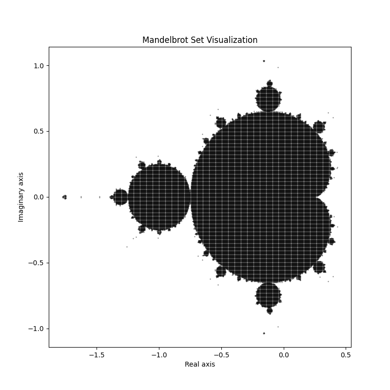
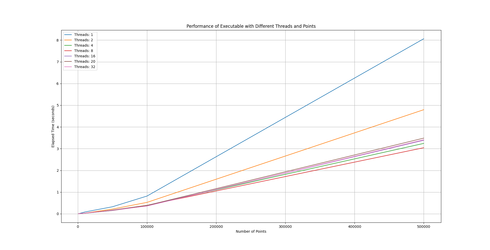

# Task 2 - Mandelbrot Set

## Task Description
Множество Мандельброта — это совокупность всех чисел c ∈ C, для которых последовательность
z(n+1) = z(n) ^ 2 + c является ограниченной для всех значений n ∈ N. Иными словами, число
c принадлежит множеству Мандельброта тогда и только тогда, когда (∃A ∈ R) (∀n ∈ N) |zn| < A
Можно доказать, что в последнем равенстве A можно взять равным двум, т.е. число c принадлежит множеству Мандельброта тогда и только
тогда, когда
(∀n ∈ N) |z(n)| < 2, z(1) = 0

## Solution description

* Программа получает количество потоков (nthreads) и количество точек для вычисления (npoints), которые будут проверяться на принадлежность к множеству Мандельброта.
* Множество Мандельброта: точка принадлежит множеству, если итерации остаются ограниченными при заданном максимальном количестве итераций (MAX_ITER).
* программа делит диапазон точек между потоками. Каждый поток обрабатывает свой диапазон точек и вычисляет координаты x и y, проверяя каждую точку на принадлежность множеству Мандельброта.
* Для записи результатов в файл используется мьютекс (pthread_mutex). Это синхронизирует доступ потоков к файлу, предотвращая data race при параллельной записи.
* Для каждого потока создается структура thread_data_t, содержащая информацию о номере потока, количестве потоков и точек, а также указатель на файл для записи.
* Если точка принадлежит множеству Мандельброта, координаты записываются в файл mandelbrot.csv. Вся запись синхронизируется с помощью мьютекса.
* Программа ожидает завершения всех потоков с помощью pthread_join, закрывает файл и уничтожает мьютекс.
* Данные визуализируются при помощи скрипта на Python

## Results analysys

Исходя из графиков, можно сказать, что также при увеличении количества потоков до 8 наблюдается сокращение времени выполнения, однако затем показатели времени не улучшаются (task1/README.md). Также на сравнительно небольшом количестве точек улучшение показателя времени незначительно.