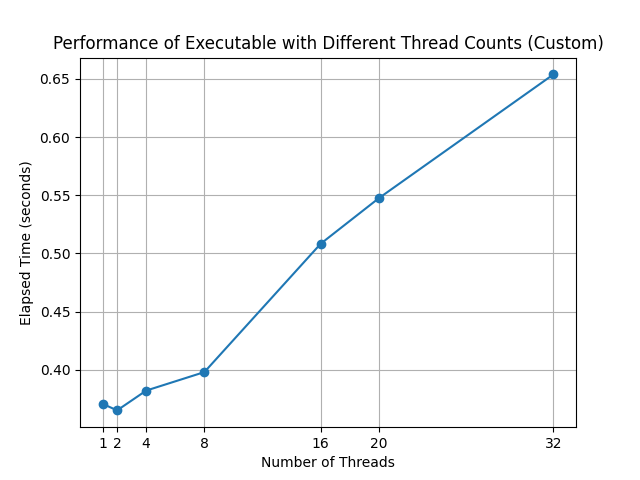
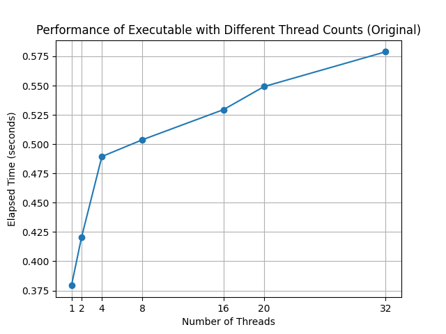

# Task 3 - Read-write lock implementation

## Task Description
В pthreads есть тип данных pthread_rwlock_t. Инициализация и
уничтожение осуществляются по знакомой схеме:
```c
int pthread_rwlock_init (
    pthread_rwlock_t∗ lock,
    pthread_rwlockattr_t attr /∗ i n ∗/
);

int pthread_rwlock_destroy (
    pthread_rwlock_t∗ lock
);

Данный тип похож на мьютексы, но допускает две фунции lock:
int pthread_rwlock_rdlock (
    pthread_rwlock_t∗ lock
);

int pthread_rwlock_wrlock (
    pthread_rwlock_t∗ lock
);

Как и для мьютексов, есть лишь одна функция типа unlock:
int pthread_rwlock_unlock (
    pthread_rwlock_t∗ lock
);
```

Когда поток получает блокировку чтения, то сколько угодно других
потоков могут также получить блокировку на чтение, но ни один поток
не получит блокировку на запись, пока все читающие потоки не вызовут
функцию unlock для данной переменной.
Когда поток получает блокировку на запись, то ни один другой поток
не сможет получить блокировку ни на чтение, ни на запись.

## Solution Description

* Init (my_rwlock_init):
    - Создаются и инициализируются три ключевых элемента:
        Мьютекс (rwlock->mutex), обеспечивающий синхронизацию доступа к переменным.
        Условные переменные (rwlock->readers_cond и rwlock->writers_cond), которые позволяют потокам ожидать, пока доступ к ресурсу станет возможным.
    - Счетчики readers_count, waiting_writers и флаг writing устанавливаются в 0. Они отслеживают количество активных читателей, ожидающих писателей и текущее состояние записи.

* Read (my_rwlock_rdlock):
    - Поток, желающий получить доступ на чтение, захватывает мьютекс.
    - Если есть ожидающие писатели или активный писатель, поток переходит в ожидание на условной переменной readers_cond, чтобы не мешать писателям.
    - Как только запись закончена и нет ожидающих писателей, поток увеличивает счетчик читателей и освобождает мьютекс.

* Write (my_rwlock_wrlock):
    - Поток, который хочет записывать, захватывает мьютекс и увеличивает счетчик ожидающих писателей (waiting_writers).
    - Поток ждет, пока не освободятся все читатели и не завершится активная запись. Это происходит через ожидание на условной переменной writers_cond.
    - После этого поток начинает писать, устанавливая флаг writing и уменьшая количество ожидающих писателей.

* Unlock (my_rwlock_unlock):

    - Если поток завершает запись, он сбрасывает флаг writing, оповещает всех ожидающих читателей и писателей, и выпускает мьютекс.
    - Если поток завершает чтение, он уменьшает счетчик читателей. Если он последний читатель и есть ожидающие писатели, поток оповещает одного из писателей через условную переменную writers_cond.

## Speed explanation




Как можно видеть, олученное решение работает быстрее стандартной реализации. Вероятное объяснение такое:
В стандартной реализации rwlock может быть принудительная приостановка читателей даже в отсутствие активных писателей. Здесь читатели продолжают работать, пока писатели просто ждут своей очереди, что может увеличить общую производительность, особенно в сценариях с преобладанием чтения.