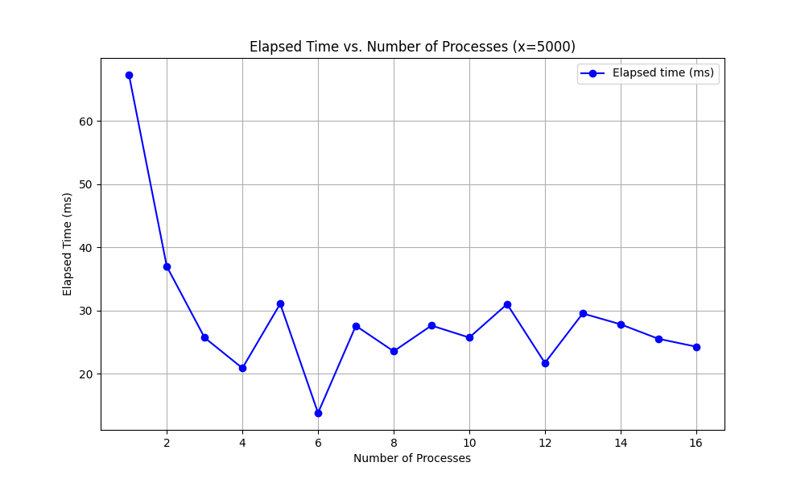
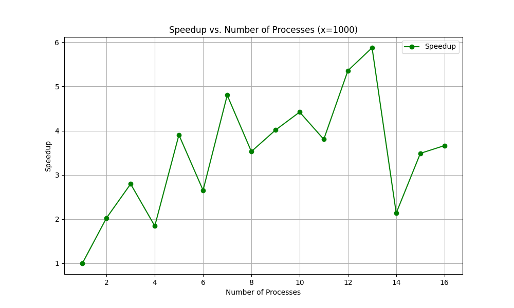
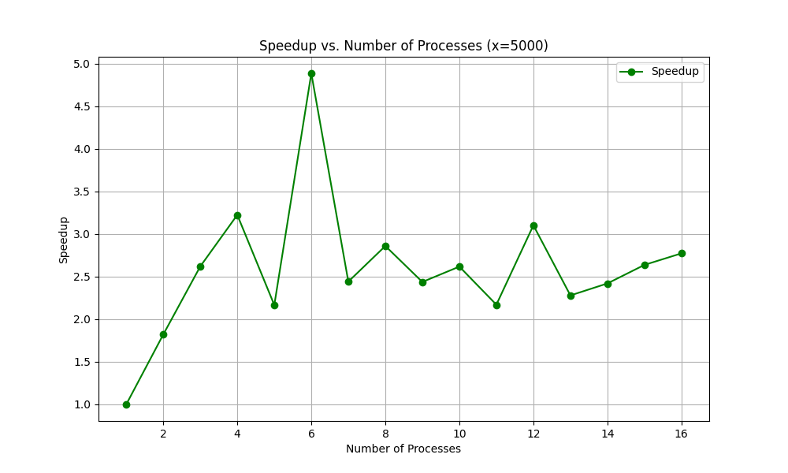
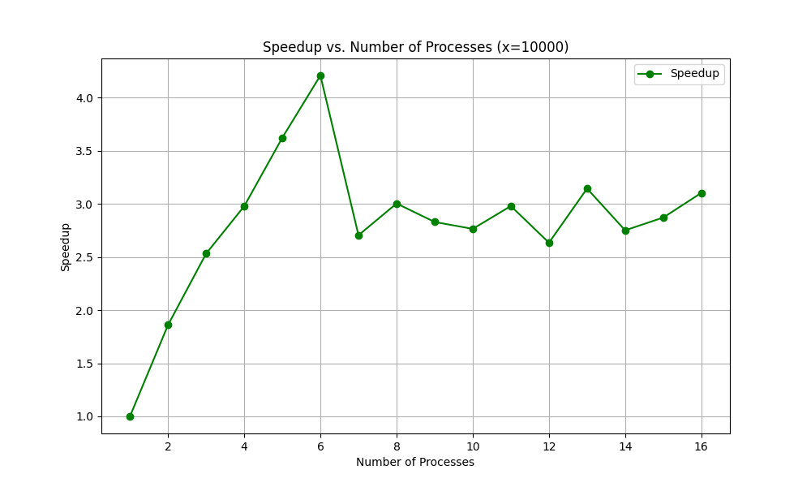

# Matrix Multiplication By Rows

## Task

Реализовать алгоритм для умножения матрицы на вектор, ис-
пользуя разбиение по строкам. Проведите
численные эксперименты, замеряя время выполнения функций при
различных размерах входных данных. Постройте графики време-
ни выполнения, ускорения и эффективности. Сделайте выводы о
быстродействии рассмотренных трех алгоритмов.

## Algorithm Description

В данной работе реализован алгоритм умножения матрицы на вектор с использованием разбиения по строкам и применением MPI для параллельной обработки. Алгоритм разделяет матрицу на равные непрерывные блоки строк, которые передаются отдельным процессам. Каждый процесс выполняет умножение своего блока строк на вектор, получая локальный результат. После вычислений локальные результаты собираются и объединяются на процессе-координаторе для формирования итогового вектора. Такой подход обеспечивает эффективное распределение вычислений и позволяет масштабировать алгоритм на большое количество процессов. Использование MPI обеспечивает синхронизацию между процессами и минимизирует накладные расходы на коммуникацию. Алгоритм протестирован на различных конфигурациях, что подтверждает его корректность и эффективность.

Корректность можно проверить и вручную, для этого необходимо собрать приложение с флагом DEBUG. В таком случае помимо вывода итогового времени также отобразятся начальная матрица и вектор, результат вычислений

## Test Results

Результаты тестов для данного алгоритма выглядят так, как показано ниже. Исходя из них можно сделать следующий вывод:

- Не имеет смысла увеличивать количество потоков на малом размере матрицы, так как затраты на создание потока будут превышать улучшение работы алгоритма
- Чем меньше матрица, тем меньшее количество потоков будут приводить к максимальной эффективности
- Не имеет смысла увеличивать количество потоков до количество большего, чем количество ядер в системе, так как эффективность при этом может падать

Местами в графиках видны случайные выпады на отдельно взятых данных, что можно объяснить как самими данными (случайная выборка), так и загрузкой системы в этот момент. Кроме того результат - усреднение между 100 запусков, соответственно один случайный большой выпад (большое время выполнения) сильно влияет на результат, особенно учитывая, что тестовый стенд достаточно мощный и умножение матриц подобного размера происходит за крайне маленькое время.

Результаты в чистом виде вместе с командой для запуска можно увидеть в директории [mpi_results](./mpi_results/)

### Time

### Speedup

