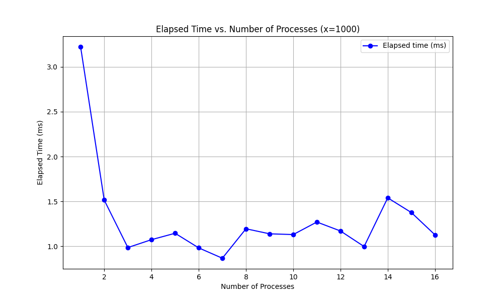
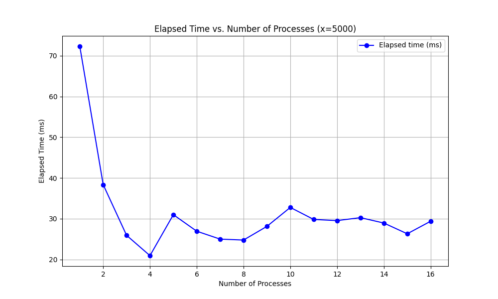
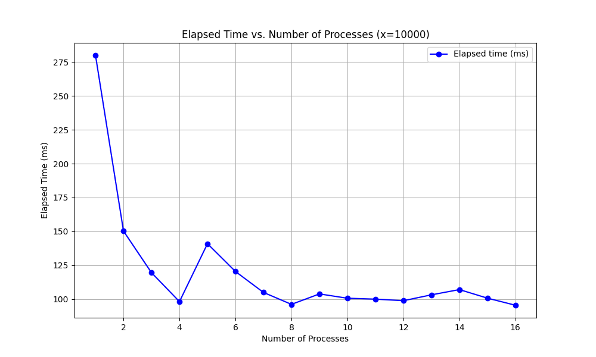
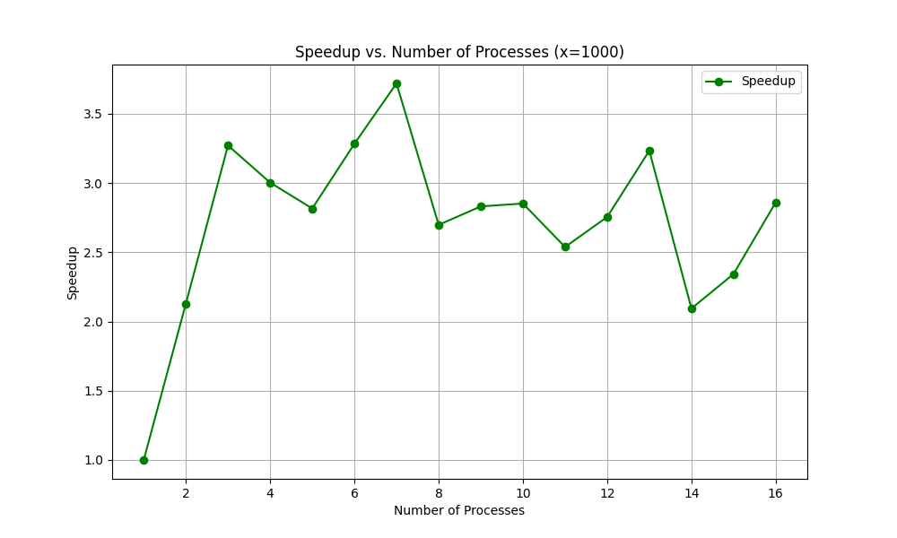
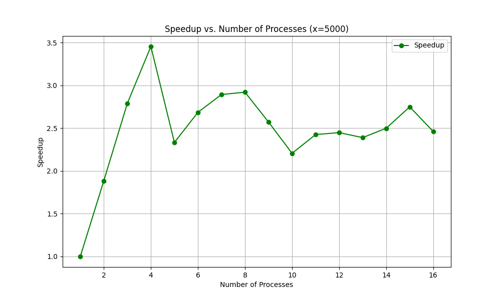
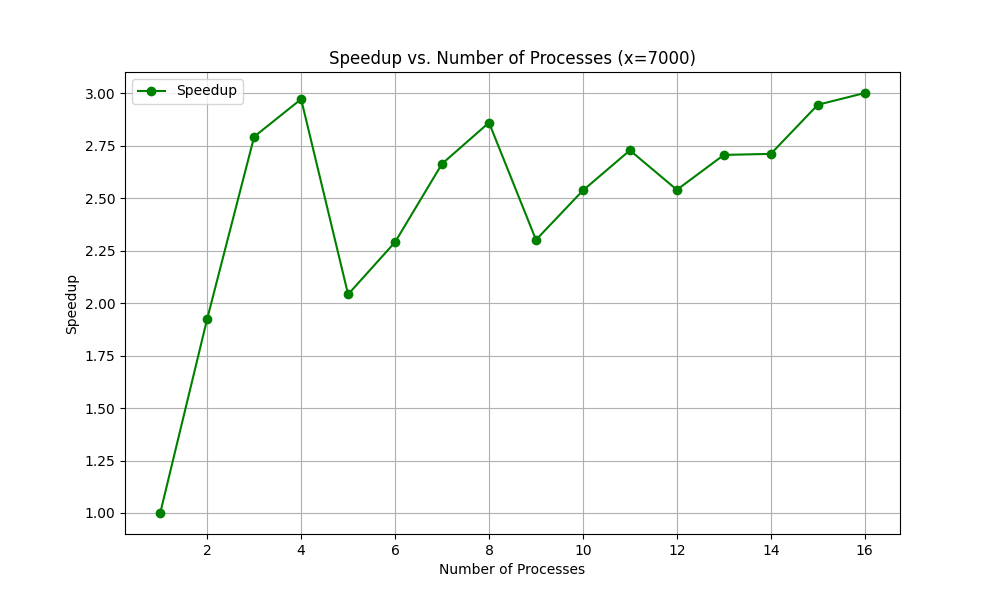
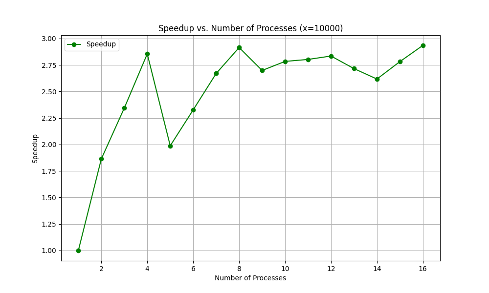

# Matrix Multiplication By Rows

## Task

Реализовать алгоритм для умножения матрицы на вектор, ис-
пользуя разбиение по строкам. Проведите
численные эксперименты, замеряя время выполнения функций при
различных размерах входных данных. Постройте графики време-
ни выполнения, ускорения и эффективности. Сделайте выводы о
быстродействии рассмотренных трех алгоритмов.

## Algorithm Description

В данной работе реализован алгоритм умножения матрицы на вектор с использованием разбиения по столбцам и применением MPI для параллельной обработки. Алгоритм распределяет столбцы матрицы между процессами, при этом вся матрица должна быть доступна в памяти каждого процесса из-за разрозненного расположения столбцов. Каждый процесс выполняет умножение своих столбцов на соответствующие элементы вектора, формируя локальный вектор результатов. После вычислений локальные векторы объединяются и суммируются на процессе-координаторе для получения итогового вектора. Такой подход позволяет эффективно использовать ресурсы при условии достаточной памяти на каждом процессе. Использование MPI обеспечивает синхронизацию и корректность объединения данных. Алгоритм продемонстрировал свою корректность и производительность на разных наборах данных.

Корректность можно проверить и вручную, для этого необходимо собрать приложение с флагом DEBUG. В таком случае помимо вывода итогового времени также отобразятся начальная матрица и вектор, результат вычислений

## Test Results

Результаты тестов для данного алгоритма выглядят так, как показано ниже. Исходя из них можно сделать следующий вывод:

- Не имеет смысла увеличивать количество потоков на малом размере матрицы, так как затраты на создание потока будут превышать улучшение работы алгоритма
- Чем меньше матрица, тем меньшее количество потоков будут приводить к максимальной эффективности
- Не имеет смысла увеличивать количество потоков до количество большего, чем количество ядер в системе, так как эффективность при этом может падать

Местами в графиках видны случайные выпады на отдельно взятых данных, что можно объяснить как самими данными (случайная выборка), так и загрузкой системы в этот момент. Кроме того результат - усреднение между 100 запусков, соответственно один случайный большой выпад (большое время выполнения) сильно влияет на результат, особенно учитывая, что тестовый стенд достаточно мощный и умножение матриц подобного размера происходит за крайне маленькое время.

Результаты в чистом виде вместе с командой для запуска можно увидеть в директории [mpi_results](./mpi_results/)

### Time

### Speedup

