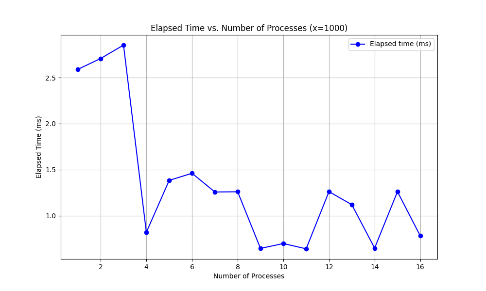
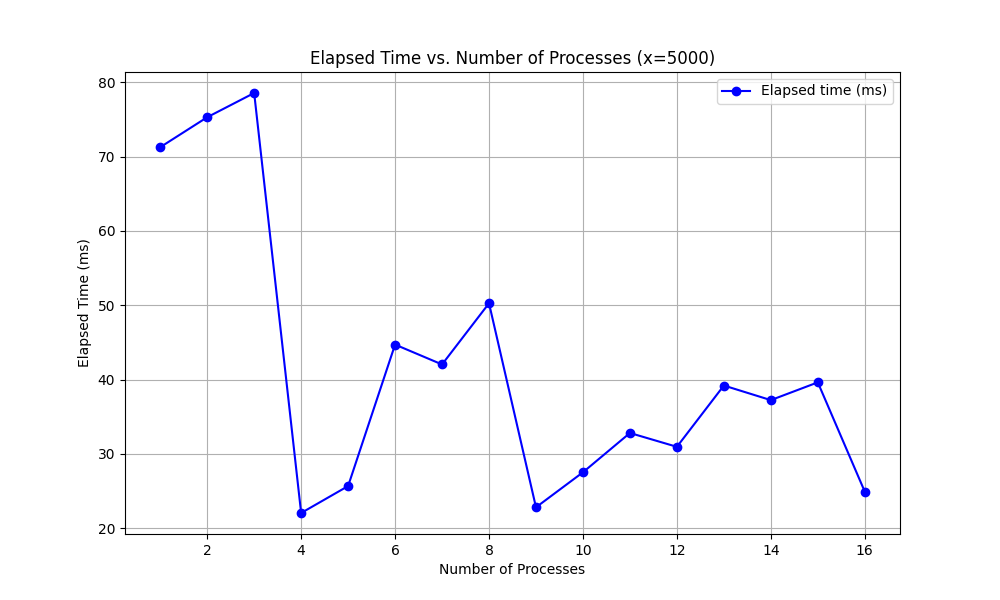
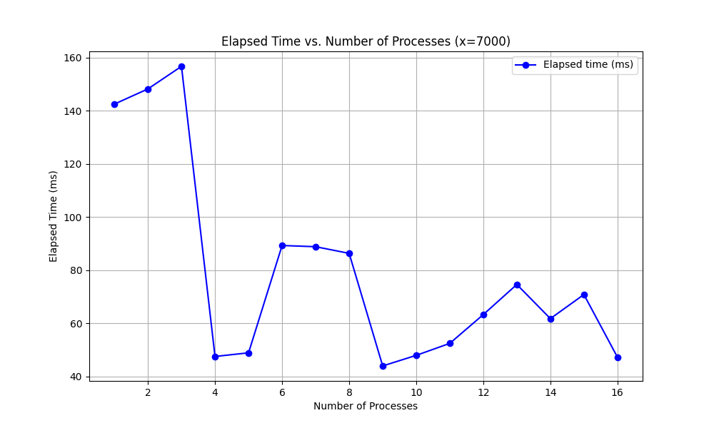
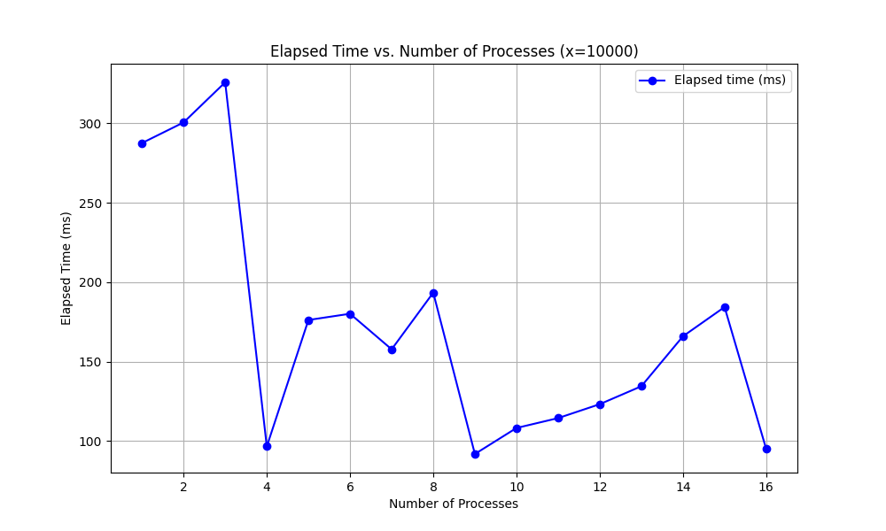
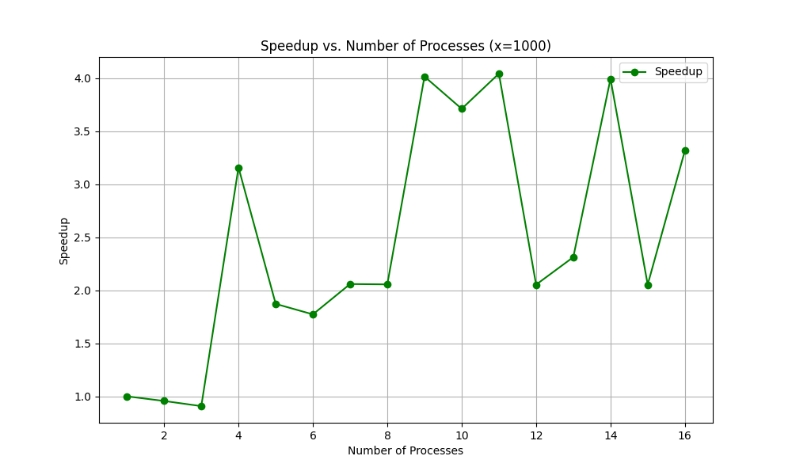
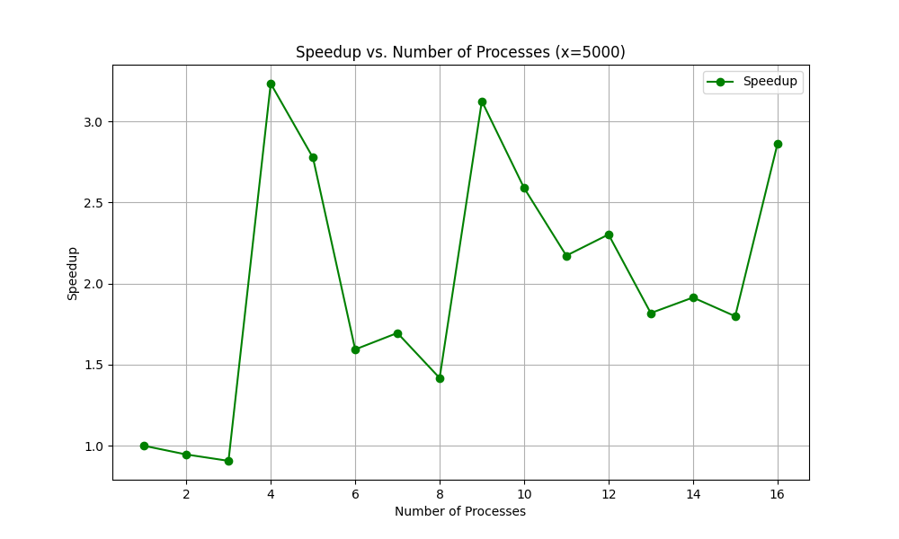
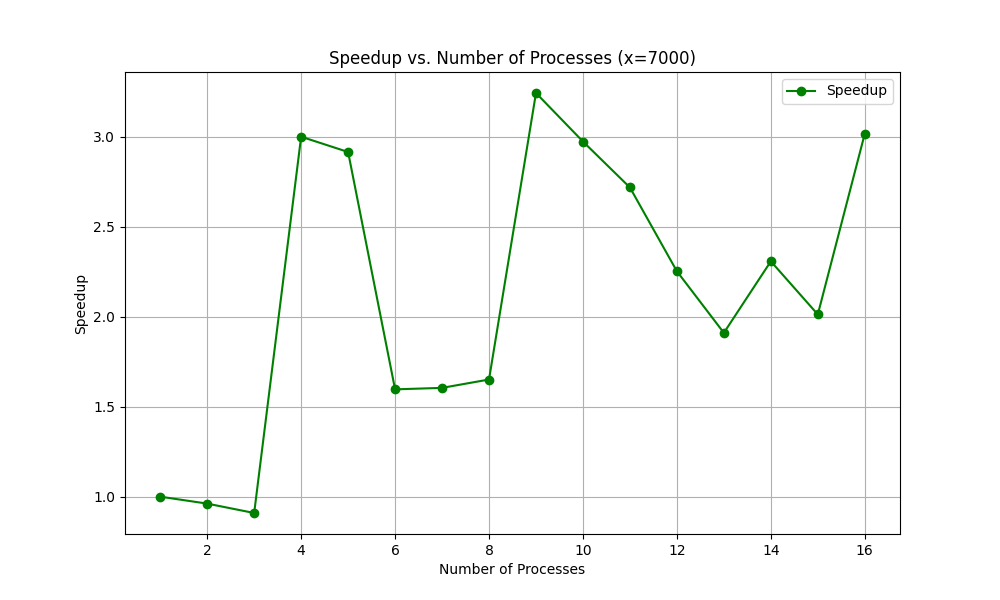
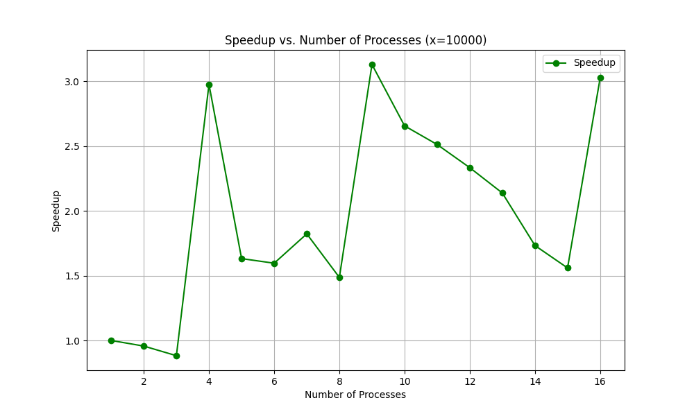

# Matrix Multiplication By Rows

## Task

Реализовать алгоритм для умножения матрицы на вектор, ис-
пользуя разбиение по блокам. Проведите
численные эксперименты, замеряя время выполнения функций при
различных размерах входных данных. Постройте графики време-
ни выполнения, ускорения и эффективности. Сделайте выводы о
быстродействии рассмотренных трех алгоритмов.

## Algorithm Description

В данной работе предложен алгоритм параллельного умножения матрицы на вектор с использованием блочного подхода и MPI. Матрица делится на сетку из N × N блоков, где размеры блоков определяются так, чтобы равномерно распределить строки и столбцы между процессами. Число процессов выбирается как ближайший полный квадрат (1, 4, 9, 16 и т.д.), чтобы создать квадратную топологию взаимодействия. Каждый процесс обрабатывает свой блок, вычисляя произведение строк этого блока на элементы вектора, соответствующие этим столбцам. Локальные результаты собираются и синхронизируются на управляющем процессе для получения итогового вектора. Блочная структура позволяет минимизировать межпроцессорное взаимодействие и добиться равномерной загрузки. Алгоритм протестирован на различных конфигурациях и подтвердил свою надёжность и производительность.

Корректность можно проверить и вручную, для этого необходимо собрать приложение с флагом DEBUG. В таком случае помимо вывода итогового времени также отобразятся начальная матрица и вектор, результат вычислений

## Test Results

Результаты тестов для данного алгоритма выглядят так, как показано ниже. Исходя из них можно сделать следующий вывод:

- Не имеет смысла увеличивать количество потоков на малом размере матрицы, так как затраты на создание потока будут превышать улучшение работы алгоритма
- Чем меньше матрица, тем меньшее количество потоков будут приводить к максимальной эффективности
- Не имеет смысла увеличивать количество потоков до количество большего, чем количество ядер в системе, так как эффективность при этом может падать
- Не имеет смысла делать количество процессов числом, из которого не извлекается квадратный корень, так как это приведёт к ухудшению работы алгоритма относительно меньшего числа процессов, являющегося целым квадратом (см. Описание алгоритма)

Результаты в чистом виде вместе с командой для запуска можно увидеть в директории [mpi_results](./mpi_results/)

### Time

### Speedup

