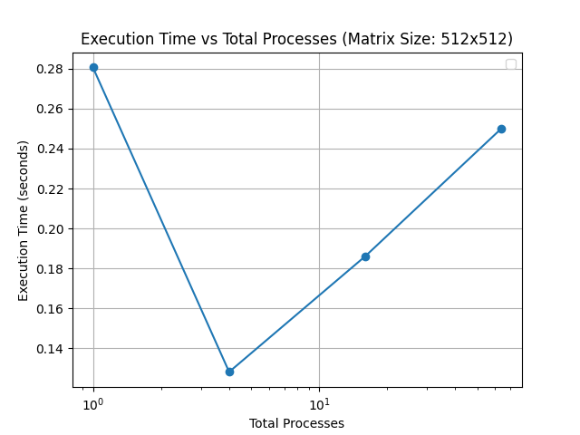
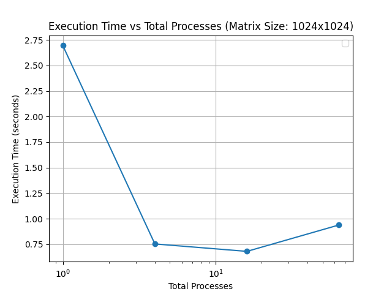
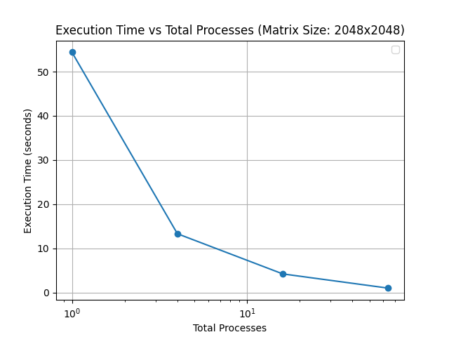
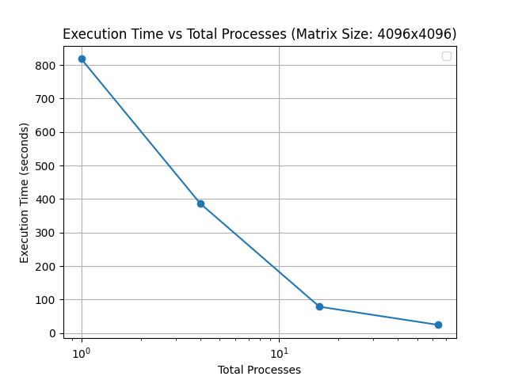

# Task 2 - The algorithm of matrix multiplication with division into blocks according to the Cannon algorithm.

## Results (in seconds)

| ------------- | 512x512|1024x1024 | 2048x2048 | 4096x4096 |
| ------------- | ------------- | ------------- | ------------- | ------------- |
| 1 proccess  | 0.280703 | 2.694634 | 54.390383 | 818.056445 |
| 4 proccess  | 0.128048 | 0.753087 | 13.323911 | 386.408538 |
| 16 proccess | 0.186085 | 0.680223 | 4.230523 | 78.563587 |
| 64 proccess | 0.250164  | 0.938657 | 1.015430 | 24.227497 |

## Graphics

## Results analysys

1. **Общая тенденция ускорения:**
   - Для всех размеров матриц наблюдается значительное снижение времени выполнения при увеличении числа потоков от 1 до 4. Это демонстрирует эффективность параллелизма при небольшом количестве потоков, так как задачи хорошо масштабируются на несколько ядер.

2. **Эффективность параллелизма:**
   - Для маленьких матриц (512x512) и 1024x1024 использование большего числа потоков (16 и 64) не приносит ощутимой пользы, а иногда даже приводит к увеличению времени. Это связано с накладными расходами на синхронизацию потоков и передачу данных.
   - Для больших матриц (2048x2048 и 4096x4096) время выполнения продолжает снижаться при увеличении потоков до 16 и 64, хотя темпы ускорения становятся менее выраженными. Это связано с тем, что вычисления становятся более доминирующими по сравнению с накладными расходами.

3. **Аномалии для маленьких матриц:**
   - Для матрицы 512x512 увеличение числа потоков с 4 до 16 и 64 приводит к увеличению времени. Это связано с высокой стоимостью управления потоками на малом объеме вычислений. Вероятно, передача данных и синхронизация занимают большую часть времени, чем сами вычисления.

4. **Влияние процессора:**
   - Компьютер, на котором запускался код, имеет **10 физических ядер и 12 потоков** (с учетом Hyper-Threading). При увеличении числа потоков до 16 и 64 система начинает использовать логические ядра и превышает возможности процессора. Это приводит к ухудшению производительности из-за конкуренции потоков за ресурсы CPU, особенно для меньших задач.

5. **Скорость масштабирования:**
   - При увеличении размеров матриц эффект параллелизма становится более выраженным, поскольку задача требует большего объема вычислений, что снижает относительные накладные расходы. Например:
     - Для 2048x2048 время выполнения на 64 потоках (1.015 секунды) более чем в 50 раз меньше, чем на 1 потоке (54.390 секунды).
     - Для 4096x4096 наблюдается значительное снижение времени при увеличении потоков до 64 (с 818 секунд до 24 секунд).

---

### Вывод по задаче:
- **Параллельный алгоритм хорошо масштабируется для больших задач.** Для 4096x4096 параллелизм дает значительное ускорение, делая задачу выполнимой в разумные сроки.
- **Увеличение числа потоков должно соответствовать размерам задачи.** Маленькие задачи (512x512) страдают от накладных расходов при большом числе потоков.
- **Характеристики оборудования влияют на результат.** Процессор достигает оптимальной производительности при числе потоков, соответствующем его архитектуре.

