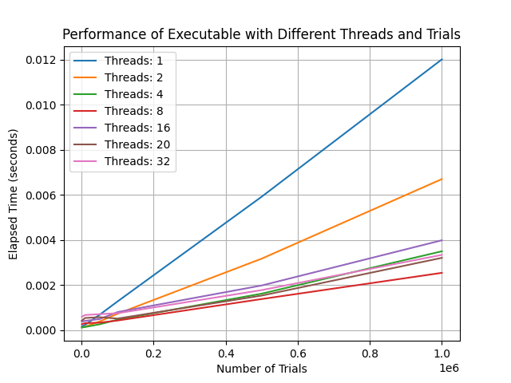

# Task 1 - π calculation

## Task Description
Требуется определить число π по методу Монте-Карло.
Именно, пусть в квадрат со стороной 2r бросается дротик (монетка, кошка или другой предмет).
Нарисуем внутри квадрата вписанную окружность с радиусом r. Ясно, что отношение количества попаданий в
окружность к общему количеству бросков будет равно π/4. Следовательно,
число π можно представить как
π ≈ (4 * Количество попаданий в окружность) / Общее количество бросков

## Solution description

* Программа принимает на вход два параметра: количество потоков (nthreads) и количество испытаний (случайных точек, ntrials), которые используются для оценки числа π.
* Каждому потоку выделяется равное количество испытаний (случайных точек). Эти точки генерируются случайным образом в квадрате с координатами от -1 до 1.
* Для каждой точки проверяется, попала ли она внутрь окружности единичного радиуса, используя уравнение круга x2+y2≤1x2+y2≤1.
* Количество точек, попавших в круг, сохраняется в структуру ThreadData для каждого потока.
* Потоки создаются с помощью pthread_create, и каждый выполняет свою часть вычислений.
* После завершения всех потоков программа суммирует количество попаданий в круг, полученное каждым потоком, и вычисляет приближённое значение π
* Засекается время выполнения

## Results analysys

Как можно наблюдать на графике, при увеличении количества потоков время выполнения сокращается, однако при количестве потоков, превышающем **8**, время выполнения перестает сокращаться, это можно объяснить тем, что на исполняемой машине **CPU** равно **8**, и, несмотря на то, что количество потоков на одном **CPU** равно **2**, в один момент времени на одном физическом ядре может выполняться только один поток, если выполняется более одного потока, то ядро вынуждено переключать контекст, и задача выполняется не параллельно, а конкуретно.

Также видно, что при сравнительно малом количестве точек время выполнения больше, вследствии того, что затраты времени на управление потоками превышает время, которое тратится на выполнение задачи.